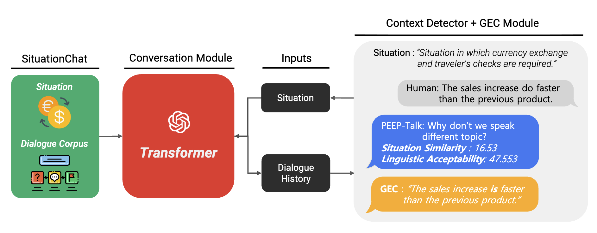

<p align="center">
  
</p>

<h1 align="center">PEEP-Talk</h1>

<h3 align="center">A Situational Dialogue-based Chatbot for English Education</h3>

<p align="center">
  <i>Accepted at the 61st Annual Meeting of the Association for Computational Linguistics (ACL 2023)</i><br>
  <i>Toronto, Canada | July 2023</i>
</p>

<p align="center">
  <a href="https://aclanthology.org/2023.acl-demo.18.pdf"></a>
  <a href="https://aclanthology.org/2023.acl-demo.18/"></a>
  <a href="https://aclanthology.org/2023.acl-demo.18.mp4"></a>
  <a href="http://peeptalk.us"></a>
  <a href="https://github.com/metterian/peep-talk/blob/master/LICENSE"></a>
</p>

<p align="center">
  
</p>

<p align="center">
  <b>Seungjun Lee</b>, <b>Yoonna Jang</b>, <b>Chanjun Park</b>, <b>Jungseob Lee</b>, <b>Jaehyung Seo</b>,<br>
  <b>Hyeonseok Moon</b>, <b>Sugyeong Eo</b>, <b>Seounghoon Lee</b>, <b>Bernardo Yahya</b>, <b>Heuiseok Lim</b><br>
  <i>Korea University</i>
</p>

---

## Abstract

PEEP-Talk is a dialogue-based educational chatbot designed to address the challenge of **limited conversational practice opportunities** for English language learners. Our system **naturally switches to a new topic or situation** in response to out-of-topic utterances, which are common among English beginners. It provides real-time **conversation feedback** and **grammar corrections**, with evaluations demonstrating a positive impact on English-speaking, grammar, and English learning anxiety.

---

## Key Features

| Feature | Description |
|---------|-------------|
| **Situational Dialogue** | Persona-based conversation system that enables situation-specific English learning |
| **Context Detector** | Automatically detects conversation flow and switches topics in real-time |
| **Grammar Feedback** | Real-time grammar error correction using GEC (Grammar Error Correction) |
| **Natural Interaction** | Provides a realistic conversational experience like talking to a real person |

---

## Architecture

<p align="center">
  
</p>

### Core Modules

- **Conversational Agent**: Built on [TransferTransfo](https://github.com/huggingface/transfer-learning-conv-ai) with situation-based persona
- **Context Detector (CD)**: Two BERT-based models for evaluating conversation quality
  - *Situation Similarity*: Fine-tuned on MRPC dataset
  - *Linguistic Acceptability*: Fine-tuned on CoLA dataset
- **Grammar Error Correction**: REST API-based grammar feedback system ([paper](https://ieeexplore.ieee.org/document/9102992))

---

## Demo

<p align="center">
  <a href="https://www.youtube.com/watch?v=PXlIEOi54wY">
    
  </a>
</p>

<p align="center">
  <a href="http://peeptalk.us"><b>Try Live Demo</b></a> |
  <a href="https://www.youtube.com/watch?v=PXlIEOi54wY"><b>Watch Video</b></a> |
  <a href="https://aclanthology.org/2023.acl-demo.18.mp4"><b>ACL Presentation</b></a>
</p>

---

## Dataset: SITUATION-CHAT

We release the **SITUATION-CHAT** dataset for situational dialogue research.

```bash
# Download test set
wget https://raw.githubusercontent.com/metterian/peep-talk/master/data/situationchat_original_test.json
```

---

## Quick Start

### Installation

```bash
git clone https://github.com/metterian/peep-talk.git
cd peep-talk
pip install -r requirements.txt
```

### Usage

```bash
# Interactive mode
python interact.py

# REST API server
python app.py

# Streamlit web interface
streamlit run web.py
```

### Training

```bash
python ./train.py \
    --dataset_path "data/situationchat_original.json" \
    --model_checkpoint "microsoft/DialoGPT-medium" \
    --gradient_accumulation_steps=4 \
    --max_history=3 \
    --n_epochs=2 \
    --num_candidates=4 \
    --personality_permutations=4 \
    --train_batch_size=8 \
    --valid_batch_size=8
```

---

## Project Structure

```
.
├── train.py                # Train conversation model
├── app.py                  # REST API server
├── interact.py             # Interactive CLI
├── web.py                  # Streamlit web interface
├── situation_example.py    # Situation annotation examples
├── example_entry.py        # SITUATION-CHAT examples
├── data/                   # Dataset directory
├── requirements.txt
└── README.md
```

---

## Citation

If you find this work useful, please cite our paper:

```bibtex
@inproceedings{lee-etal-2023-peep,
    title = "{PEEP}-Talk: A Situational Dialogue-based Chatbot for {E}nglish Education",
    author = "Lee, Seungjun  and
      Jang, Yoonna  and
      Park, Chanjun  and
      Lee, Jungseob  and
      Seo, Jaehyung  and
      Moon, Hyeonseok  and
      Eo, Sugyeong  and
      Lee, Seounghoon  and
      Yahya, Bernardo  and
      Lim, Heuiseok",
    booktitle = "Proceedings of the 61st Annual Meeting of the Association for Computational Linguistics (Volume 3: System Demonstrations)",
    month = jul,
    year = "2023",
    address = "Toronto, Canada",
    publisher = "Association for Computational Linguistics",
    url = "https://aclanthology.org/2023.acl-demo.18",
    doi = "10.18653/v1/2023.acl-demo.18",
    pages = "181--190",
}
```

---

## License

This project is licensed under the MIT License - see the [LICENSE](LICENSE) file for details.

---

<p align="center">
  <sub>If you have any questions, feel free to open an issue or contact us.</sub>
</p>
